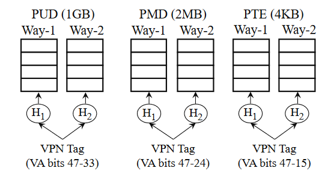

# 15-618 Final Project Proposal

## Title

Performance evaluation on parallel address translation lookup using hardware page table walker supporting Elastic Cuckoo Page Table  
### Team Member: Quanchen (Peter) Ding

## URL: 
https://github.com/PeterDing372/15-618-Final-Project.git

## Summary

We will implement a hardware page table walker with Chisel (Scala) for an open-source RISC-V Core and evaluate its performance with RTL exact software simulation. The evaluation includes a look-up latency comparison between the traditional Radix Page Table and Elastic Cuckoo Page Table in terms of memory access statistics and delay. 

## Background

For applications that span a large memory footprint, address translation takes place often and can sometimes take up a large amount of the overall execution time. This is due to the nature of traditional Radix Page Tables requiring sequential memory access to fetch the page table entry (PTE). At the same time, scaling TLB is difficult as large TLBs require longer latency and power. The Elastic Cuckoo Page Table proposal attempts to address the critical path of page table walks[1]. The idea is to re-format the multi-level structure of traditional page tables into a flat layout enabling parallel look-up to all ways of the page table entries.  

Figures 1, and 2 (Skarlatos et al., 2020) are adapted from the original paper for illustration. [Figure 1] shows the traditional Radix page table layout which requires 4 sequential accesses to fetch the PTE. [Figure 2] shows the ECPT layout being flat where the page table walker can issue parallel memory requests to fetch the PTEs. Each way is a hashed page table and each entry is fetched with the hashed VPN Tag to index into the page tables. 

Figure 1: Radix page table address translation in x86-64. Adapted from Skarlatos, D., Kokolis, A., Xu, T., & Torrellas, J. (2020)

Figure 2: Elastic cuckoo page tables for a process. Adapted from Skarlatos, D., Kokolis, A., Xu, T., & Torrellas, J. (2020)

Building on the original paper’s evaluation methodology, we want a more comprehensive evaluation with a full-system evaluation where the Page Table Walker is fully embedded into a robust processor. We will use the Berkeley Out-of-Order Machine (BOOM) as our target processor[2]. To do RTL exact software emulation, we will use the Chipyard [3] to compile the processor. 

## The Challenge

- **Cache Line pollution:** For each address translation, the lookups to different ways in the page table do not have a dependency, however, the total number of requests made to the memory can potentially be larger than the traditional page table. This could potentially pollute our cache lines evicting cache entries that may be referenced in the near future.
- **Larger L1 Cache access:** Page table entry clustering allows 8 consecutive PTE entries to be put in the same 64-byte cache line and spread the tags to the reserved bits for each PTE. This means the number of accesses to L1 cache is increased as we have to fetch all 8 PTEs to make a tag match. In addition, as cache ports are 64-bits wide, we need to make 8 sequential accesses to the cache to get the hit result of one way in the ECPT. This will potentially be our bottleneck.

# Converting the provided text into a README file

readme_content = """
# Goals and Deliverables

### 1. **Profiling and Performance Evaluation:**

- **Objective:** Conduct a thorough profiling and performance evaluation that summarizes and compares the cache activities of both Radix Page Table and Elastic Cuckoo Page Table.
- **Workloads:** As we are only simulating the lookup behavior of the page table walker, the specific workload does not make a huge difference as long as the memory footprint of the workload spans a large memory space.
- **Motivation**: This is essential to understand the efficiency and effectiveness of these page table structures in managing memory accesses. The profiling will focus on aspects such as cache hit-and-miss rates, memory access patterns, and latency. By analyzing cache activities, I can gain insights into their operational strengths and weaknesses.
- **Justification:** I have a structural code of the page table walker for ECPT in Chisel (Scala). The next step to do is to migrate the functionality into the original page table walker to verify correctness satisfying the ISA requirement.
- **Method:** This will involve running assembly code on the implemented design of a hardware ECPT page table walker for a RISC-V core. As this evaluation does not involve OS, there is no page table management. Therefore, the content of the assembly code is composed of two parts:
    1. Loading the corresponding page table entries to desired memory locations
    2. Hard coding RISC-V instructions that perform the lookup on the stored page table entries. 

## ****Goals You Hope to Achieve:****

### 1. **Full Functional Correctness & Simple OS (rCore-os):**

- **Objective:** Successfully expose the ECPT to ISA and tune a simple operating system to run the full system with ECPT.
- **Justification:** rCore-os is a relatively simpler OS that supports both virtual memory and RISC-V architecture compared to Linux.

# Resources

There are 3 major components that are required to do the evaluation:

### 1. Page Table Entries for a workload

We will be using AWS EC2 ubuntu virtual machine to get the page table entries of the workload.

EC2 provides a great isolated environment to run the workloads on and provides `sudo` permissions to look into the kernel and fetch `pagemap` files which stores the page table entries for specific processes[4]. 

### 2. Open Source Core

We will be using the Berkeley Out-of-Order Machine (BOOM) as our reference processor. 

### 3. Simulation Platform

We will use Verilator for RTL software simulation 

# Platform Choice

The reason for using BOOM and Verilator is that first, both are open-source and allow for academic use. At the same time, both are embedded into the Chipyard Framework, which is a framework for designing and evaluating full-system hardware. 

# Schedule

| Week Starting | Objective | Activities |
| --- | --- | --- |
| 2023-11-15 | Functionality of ECPT PTW | 1. Incorporate ECPT design with original PTW to satisfy ISA requirement   2. Testing correctness with standalone top-level testbench |
| 2023-11-20 | Functionality of ECPT PTW  | 1. Finish verifying the functional correctness of PTW |
| 2023-11-27 | Workload Page Table Dump | 1. Work on getting the page table dump and formatting the radix PTEs into an ECPT page tabl |
| 2023-12-04 | Gather information from the simulation | 1. Compile the simulation binary and test on assembly
2. Get cache statistics with simulation |
| 2023-12-11 | Final report | put together comparison and write report |

# References

[1] Skarlatos, Dimitrios, Apostolos Kokolis, Tianyin Xu, and Josep Torrellas. “Elastic Cuckoo Page Tables: Rethinking Virtual Memory Translation for Parallelism.” In *Proceedings of the Twenty-Fifth International Conference on Architectural Support for Programming Languages and Operating Systems*, 1093–1108. Lausanne Switzerland: ACM, 2020. https://doi.org/10.1145/3373376.3378493.

[2] Zhao, J., Korpan, B., Gonzalez, A., & Asanović, K. (2020, May). SonicBOOM: The 3rd Generation Berkeley Out-of-Order Machine. Paper presented at the Fourth Workshop on Computer Architecture Research with RISC-V.

[3] Amid, A., Biancolin, D., Gonzalez, A., Grubb, D., Karandikar, S., Liew, H., Magyar, A., Mao, H., Ou, A., Pemberton, N., Rigge, P., Schmidt, C., Wright, J., Zhao, J., Shao, Y. S., Asanović, K., & Nikolić, B. (2020). Chipyard: Integrated Design, Simulation, and Implementation Framework for Custom SoCs. IEEE Micro, 40(4), 10-21. https://doi.org/10.1109/MM.2020.2996616

[4] ARM64 Architecture Team. (n.d.). PTDump. Retrieved from https://docs.kernel.org/arch/arm64/ptdump.html

